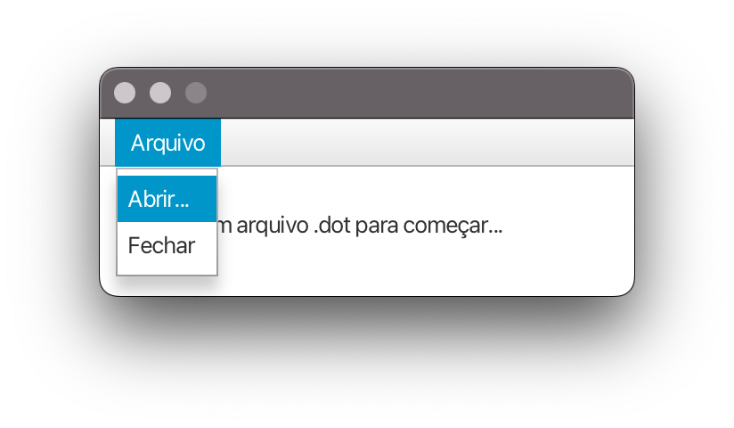
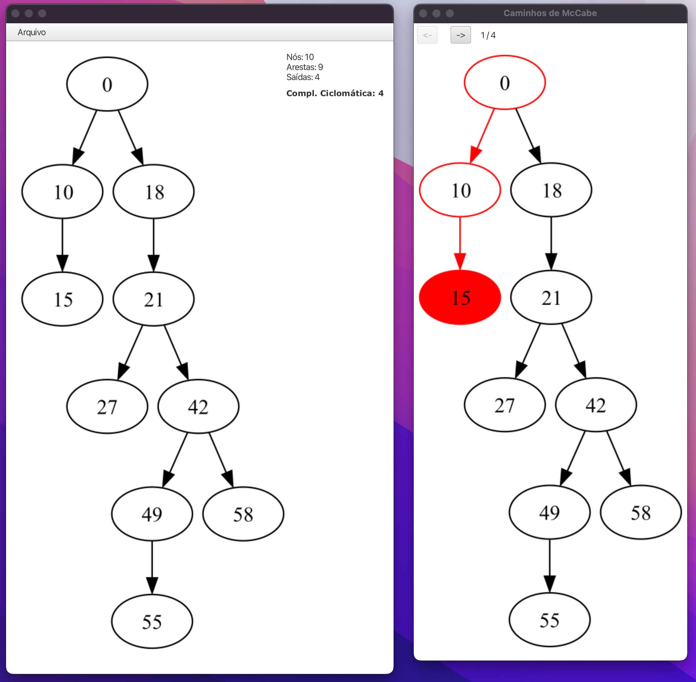

# Indicador de Caminhos usando Critérios de McCabe


## Instalação

Para instalar o programa, basta clonar o repositório e instalar as dependências do projeto com Maven:

```sh
git clone https://github.com/gabriellimoni/vv-e-t-mc-cabe-paths ./mccabe
cd mccabe
mvn install
```

## Como usar

1. Para executar o programa, utilize o Maven:

```sh
mvn javafx:run
```

2. Para abrir o arquivo `.dot` que se deseja analisar, clique no menu `Arquivo` e selecione a opção `Abrir`. Selecione o arquivo `.dot` desejado.



3. Em seguida, serão abertas duas janelas, uma exibindo o grafo original e outra exibindo os caminhos encontrados. Utilize as setas na janela da direita para navegar entre os caminhos.




##
## Autores

* Gabriel Limoni - https://github.com/gabriellimoni
* Kayane Silva - https://github.com/KayRSilva
* Vitor Barth - https://github.com/vbob
